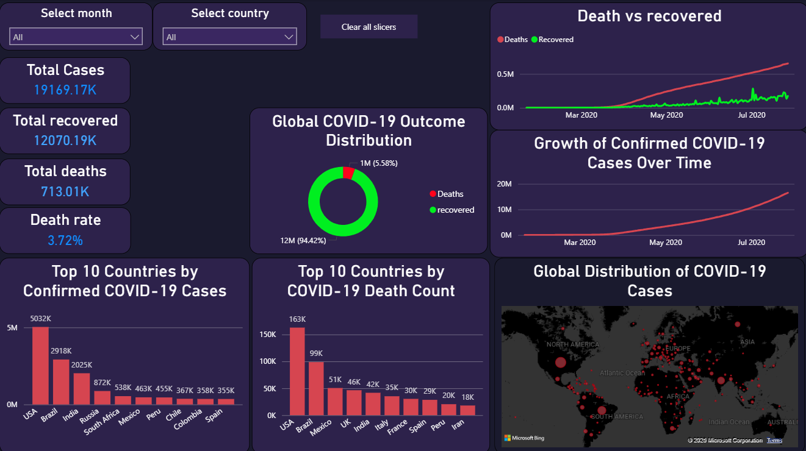

# Power BI — COVID-19 Global Impact Dashboard

This folder contains the final Power BI dashboard built on the COVID-19 2020 dataset. The dashboard visualizes the global spread and impact of COVID-19 across countries, covering confirmed cases, deaths, recoveries, and geographic distribution.

---

## File

| File | Description |
|---|---|
| covid_dashboard.pbix | Power BI dashboard file with all measures and visuals |
| covid_dashboard.png | Static screenshot of the final dashboard |

---

## Data Model

The COVID-19 CSV dataset was imported directly into Power BI. A single table was used with no relationships required.

| Table | Description |
|---|---|
| covid_data | Main table containing country, date, confirmed, deaths, and recovered columns |

---

## DAX Measures

| Measure | Formula | Table |
|---|---|---|
| Total Cases | SUM(covid_data[Confirmed]) | covid_data |
| Total Deaths | SUM(covid_data[Deaths]) | covid_data |
| Total Recovered | SUM(covid_data[Recovered]) | covid_data |
| Death Rate | DIVIDE([Total Deaths], [Total Cases], 0) * 100 | covid_data |

---

## Dashboard Visuals

| Visual | Type | Fields Used |
|---|---|---|
| Total Cases | KPI Card | Total Cases measure |
| Total Deaths | KPI Card | Total Deaths measure |
| Total Recovered | KPI Card | Total Recovered measure |
| Death Rate | KPI Card | Death Rate measure |
| Growth of Confirmed Cases Over Time | Line Chart | Date, Total Cases |
| Deaths vs Recoveries Over Time | Line Chart | Date, Total Deaths, Total Recovered |
| Top 10 Countries by Confirmed Cases | Bar Chart | Country, Total Cases |
| Top 10 Countries by Death Count | Bar Chart | Country, Total Deaths |
| Global Outcome Distribution | Donut Chart | Total Deaths, Total Recovered |
| Global Distribution of COVID-19 Cases | Bubble Map | Country, Total Cases |

---

## Slicers

| Slicer | Field | Purpose |
|---|---|---|
| Select Month | Date (Month) | Filter all visuals by month |
| Select Country | Country | Filter all visuals by country |

---

## Key Insights

**USA Dominance** — The United States recorded the highest confirmed cases and death count globally in 2020, significantly ahead of all other countries.

**Recovery Rate** — Global recovery rate stood at approximately 94.42% with a death rate of 5.58%, indicating that the majority of confirmed cases recovered.

**Exponential Growth** — Confirmed cases grew steadily from January 2020 with a sharp exponential acceleration from March onward, reflecting the global spread of the pandemic.

**Geographic Concentration** — Europe and South Asia were the most heavily affected regions outside North America, visible clearly through the bubble map distribution.

**Monthly Trend** — Case counts grew consistently month over month throughout 2020 with no plateau observed within the dataset period.

---

## Dashboard Preview

---

## Author

Arshiyan Mairaj
[LinkedIn](https://linkedin.com/in/arshiyanmairaj/) | [GitHub](https://github.com/Arshiyan7)